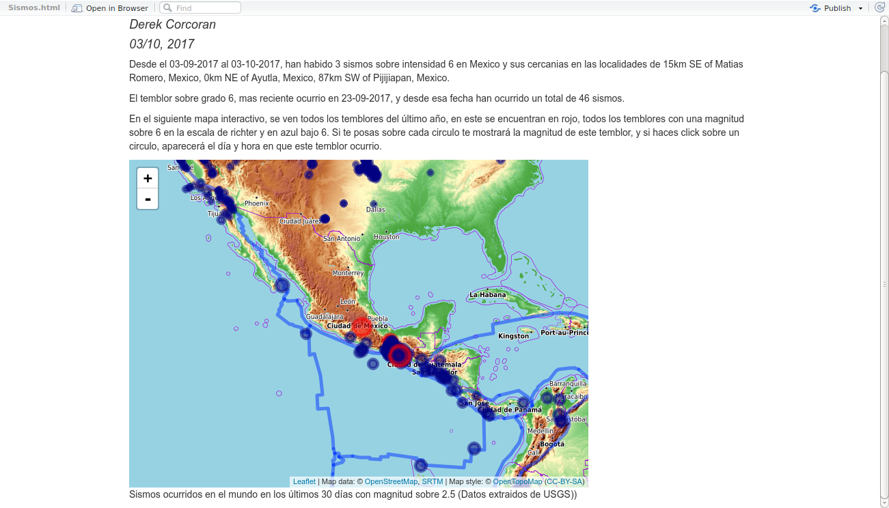

<style>
.reveal h1, .reveal h2, .reveal h3 {
  word-wrap: normal;
  -moz-hyphens: none;
}
</style>

<style>
.small-code pre code {
  font-size: 1em;
}
</style>

Clase 2: Investigación reproducible
========================================================
author: Derek Corcoran
date: "10/08, 2018"
autosize: true
transition: rotate

¿Que es investigación reproducible?
========================================================


- Código, datos (**Crudos**) y texto entrelazados
- en R: Rmarkdown (Rmd) y Rpresentation (Rpres) entre otros


Metas del día de hoy
========================================================

1.  Primer commit en github
2.  Un código en un chunk
3.  Un inline code
4.  Una tabla en el Rmarkdown
5.  Generar una primera exploración de datos con la base de datos


Github
========================================================

- Como "Google Drive" o "Dropbox" para código
- Control de cambios (Podemos volver a cualquier versión anterior)
- En base a codigo (idealmente), pero hay GUIs
- Cada proyecto es un repositorio

***


Crear primer repositorio
========================================================

- Crearse cuenta en github.com
- Crear repositorio en github


Crear primer repositorio
========================================================


Copiar la url
========================================================


Volvamos a RStudio
========================================================

* Creamos un proyecto nuevo


Pegamos la URL 
========================================================


La nueva pestaña git
========================================================


Los "¿tres?" pasos de un repositorio 
=============================

* **Git add:** Agregar a los archivos que vas a guardar
* **Git commit:** Guardar en el repositorio local (Mi computador)
* **Git push:** Guardar en el repositorio remoto (En la nube)

Git Add
========

* Sumar un archivo al repositorio
* ¿Cuando no hacerlo?
    + Limite de un archivo de 100 Mb
    + Límite de un repositorio de un Gb


Git commit
========

* Con esto dices quiero guardar mis cambios en mi disco duro
* Se guarda en tu repositorio local (Tu computador)


Mensaje del commit
========

* Debe ser relevante (ejemplo, no poner *Version final ahora si*)
* Si te equivocas puedes restablecer a cualquier commit anterior (si sabes cual es)


A guardar el repositorio (git push)
========================================================

* Con esto subes tu commit a la nube (queda respaldado)


Reproducibilidad en R
========================================================


***

1. Una carpeta
    + Datos crudos (csv, xls, html, json)
    + Codigo y texto (Rmd, Rpres, shiny)
    + Resultados (Manuscrito, Pagina Web, App)

Antes de empezar (importar datos)
=========================
incremental:true

* Hasta ahora hemos usado `data` (sólo para bases incorporadas en R)
* Dede hoy usaremos `read_csv` (Para csv, para otros archivos hay otras funciones)


Crear un nuevo Rmarkdown
========================================================


Partes de un Rmd
========================================================
left: 30%

1. Texto
2. Cunks
3. Inline code
4. [Cheat sheet Rmd](https://www.rstudio.com/wp-content/uploads/2015/02/rmarkdown-cheatsheet.pdf)
5. El botón mágico **Knit**

***


Texto
========================================================
class: small-code

# Titulo

## subtitulo

*cursiva*

**negrita**

[link](https://stackoverflow.com/users/3808018/derek-corcoran)

***


```r
# Titulo

## subtitulo

*cursiva*

**negrita**

[link](https://stackoverflow.com/users/3808018/derek-corcoran)
```

Chunks
========================================================
incremental:true


+ *echo* = T o F muestro o no codigo
+ *message* = T o F muestra mensajes de paquetes
+ *warning* = T o F muestra advertencias 
+ *eval* = T o F evaluar o no el código
+ *cache* = T o F guarda o no el resultado
+ Para más opciones ver este [link](https://yihui.name/knitr/options/)


Inline code
========================================================


- Código entrelazado en el texto
- Para actualizar medias, máximos, mínimos
- Valores de p, diferencias estadísticas
- Pueden ser vectores, no tablas.

Ejemplo
========================================================

Pueden copiar el codigo de el siguiente [link](https://raw.githubusercontent.com/derek-corcoran-barrios/CursoR/master/Clase1/Sismos.Rmd), copiarlo en un archivo rmd, apretar knit y debieran ver algo como esto:

- Otro [ejemplo](http://ec2-18-191-191-69.us-east-2.compute.amazonaws.com:3838/WhereToLive/)



Ejercicio 1
==============================
incremental: true

* Usando la base de datos *iris* crea un inline code que diga cuál es la media del largo del pétalo de la especie *Iris virginica*
    + solución:
    + la media para I. virginica es 5.552
    + "la media para I. virginica es "r mean((iris %>% filter(Species == "virginica"))$Petal.Length)""


Tablas: Kable
========================================================

- kable parte de knitr, tabla igual a lo ingresado 
- [stargazer](https://cran.r-project.org/web/packages/stargazer/vignettes/stargazer.pdf), comparación de modelos
- otras opciones como texreg


Armemos nuestras propias tablas!!!
========================================================


