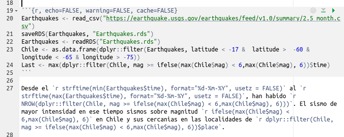

<style>
.reveal h1, .reveal h2, .reveal h3 {
  word-wrap: normal;
  -moz-hyphens: none;
}
</style>

<style>
.small-code pre code {
  font-size: 1em;
}
</style>

Clase 2: Investigación reproducible
========================================================
author: Derek Corcoran
date: "05/08, 2018"
autosize: true
transition: rotate

¿Que es investigación reproducible?
========================================================


- Código, datos (**Crudos**) y texto entrelazados
- en R: Rmarkdown (Rmd) y Rpresentation (Rpres) entre otros


Github
========================================================

- Como "Google Drive" o "Dropbox" para código
- Control de cambios (Podemos volver a cualquier versión anterior)
- En base a codigo (idealmente), pero hay GUIs
- Cada proyecto es un repositorio

***


Crear primer repositorio (Meta 4)
========================================================

- Crearse cuenta en githib.com
- Crear repositorio en github

Crear primer repositorio (Meta 4)
========================================================

- git remote add origin "URL del repositorio remoto"
- git remote -v
- git push origin master

De ahí en adelante
========================================================

- git add -A (a menos que tengas un archivo muuuy grande)
- git commit -am "<mensaje a recordar>"
- git push

A guardar el repositorio
========================================================


Reproducibilidad en R
========================================================


***

1. Una carpeta
    + Datos crudos (csv, xls, html, json)
    + Codigo y texto (Rmd, Rpres, shiny)
    + Resultados (Manuscrito, Pagina Web, App)

Metas del día de hoy
========================================================

1.  Un código en un chunk
2.  Un inline code
3.  Una tabla en el Rmarkdown
4.  Primer commit en github
5.  Entender que significan las metas de hoy

Crear un nuevo Rmarkdown
========================================================


Partes de un Rmd
========================================================
left: 30%

1. Chunks
2. Texto
3. Inline code
4. [Cheat sheet Rmd](https://www.rstudio.com/wp-content/uploads/2015/02/rmarkdown-cheatsheet.pdf)
5. El botón mágico **Knit**

***



Chunks (Meta 1)
========================================================


+ *echo* = T o F muestro o no codigo
+ *message* = T o F muestra mensajes de paquetes
+ *warning* = T o F muestra advertencias 
+ hasta el infinito

Texto
========================================================
class: small-code

# Titulo

## subtitulo

*cursiva*

**negrita**

[link](https://stackoverflow.com/users/3808018/derek-corcoran)

***


```r
# Titulo

## subtitulo

*cursiva*

**negrita**

[link](https://stackoverflow.com/users/3808018/derek-corcoran)
```

Inline code (Meta 2)
========================================================


- Código entrelazado en el texto
- Para actualizar medias, maximos, minimos
- Valores de p, diferencias estadísticas

Ejemplo
========================================================

Pueden copiar el codigo de el siguiente [link](https://raw.githubusercontent.com/derek-corcoran-barrios/CursoR/master/Clase1/Sismos.Rmd), copiarlo en un archivo rmd, apretar knit y debieran ver algo como esto:

- Otro [ejemplo](http://ec2-18-191-191-69.us-east-2.compute.amazonaws.com:3838/WhereToLive/)


Ejercicio 1
==============================
incremental: true

* Usando la base de datos *iris* crea un inline code que diga cuál es la media del largo del pétalo de la especie *Iris virginica*
    + solución:
    + la media para I. virginica es 5.552
    + "la media para I. virginica es "r mean((iris %>% filter(Species == "virginica"))$Petal.Length)""


Empezemos a trabajar!!!
========================================================


Tablas: Kable y Stargazer
========================================================

- kable parte de knitr, tabla igual a lo ingresado 
- [stargazer](https://cran.r-project.org/web/packages/stargazer/vignettes/stargazer.pdf) mas avanzado, comparación de modelos
- otras opciones como texreg

Stargazer: Tablas resumen (Meta 3)
========================================================

- Chunk debe estar en results: "asis"
- Si es para html la opción debe estar en type = "html"
- Si es para pdf la opción debe estar en type = "latex"
- Se puede exportar tabla


```r
library(stargazer)
stargazer(iris,type = "html")
```


<table style="text-align:center"><tr><td colspan="8" style="border-bottom: 1px solid black"></td></tr><tr><td style="text-align:left">Statistic</td><td>N</td><td>Mean</td><td>St. Dev.</td><td>Min</td><td>Pctl(25)</td><td>Pctl(75)</td><td>Max</td></tr>
<tr><td colspan="8" style="border-bottom: 1px solid black"></td></tr><tr><td style="text-align:left">Sepal.Length</td><td>150</td><td>5.843</td><td>0.828</td><td>4.300</td><td>5.100</td><td>6.400</td><td>7.900</td></tr>
<tr><td style="text-align:left">Sepal.Width</td><td>150</td><td>3.057</td><td>0.436</td><td>2.000</td><td>2.800</td><td>3.300</td><td>4.400</td></tr>
<tr><td style="text-align:left">Petal.Length</td><td>150</td><td>3.758</td><td>1.765</td><td>1.000</td><td>1.600</td><td>5.100</td><td>6.900</td></tr>
<tr><td style="text-align:left">Petal.Width</td><td>150</td><td>1.199</td><td>0.762</td><td>0.100</td><td>0.300</td><td>1.800</td><td>2.500</td></tr>
<tr><td colspan="8" style="border-bottom: 1px solid black"></td></tr></table>

Stargazer: Resumen de modelos economía combustible 1
========================================================


```r
data("mtcars")
kable(head(mtcars))
```


|                  |  mpg| cyl| disp|  hp| drat|    wt|  qsec| vs| am| gear| carb|
|:-----------------|----:|---:|----:|---:|----:|-----:|-----:|--:|--:|----:|----:|
|Mazda RX4         | 21.0|   6|  160| 110| 3.90| 2.620| 16.46|  0|  1|    4|    4|
|Mazda RX4 Wag     | 21.0|   6|  160| 110| 3.90| 2.875| 17.02|  0|  1|    4|    4|
|Datsun 710        | 22.8|   4|  108|  93| 3.85| 2.320| 18.61|  1|  1|    4|    1|
|Hornet 4 Drive    | 21.4|   6|  258| 110| 3.08| 3.215| 19.44|  1|  0|    3|    1|
|Hornet Sportabout | 18.7|   8|  360| 175| 3.15| 3.440| 17.02|  0|  0|    3|    2|
|Valiant           | 18.1|   6|  225| 105| 2.76| 3.460| 20.22|  1|  0|    3|    1|

Stargazer: Resumen de modelos economía combustible 2
========================================================


```r
M1 <- lm(mpg~wt, data = mtcars)
M2 <- lm(mpg~hp, data = mtcars)
M3 <- lm(mpg~hp + wt, data = mtcars)
```

========================================================
class: small-code


```r
stargazer(M1, M2, M3, type ="html", single.row=TRUE)
```


<table style="text-align:center"><tr><td colspan="4" style="border-bottom: 1px solid black"></td></tr><tr><td style="text-align:left"></td><td colspan="3"><em>Dependent variable:</em></td></tr>
<tr><td></td><td colspan="3" style="border-bottom: 1px solid black"></td></tr>
<tr><td style="text-align:left"></td><td colspan="3">mpg</td></tr>
<tr><td style="text-align:left"></td><td>(1)</td><td>(2)</td><td>(3)</td></tr>
<tr><td colspan="4" style="border-bottom: 1px solid black"></td></tr><tr><td style="text-align:left">wt</td><td>-5.344<sup>***</sup> (0.559)</td><td></td><td>-3.878<sup>***</sup> (0.633)</td></tr>
<tr><td style="text-align:left">hp</td><td></td><td>-0.068<sup>***</sup> (0.010)</td><td>-0.032<sup>***</sup> (0.009)</td></tr>
<tr><td style="text-align:left">Constant</td><td>37.285<sup>***</sup> (1.878)</td><td>30.099<sup>***</sup> (1.634)</td><td>37.227<sup>***</sup> (1.599)</td></tr>
<tr><td colspan="4" style="border-bottom: 1px solid black"></td></tr><tr><td style="text-align:left">Observations</td><td>32</td><td>32</td><td>32</td></tr>
<tr><td style="text-align:left">R<sup>2</sup></td><td>0.753</td><td>0.602</td><td>0.827</td></tr>
<tr><td style="text-align:left">Adjusted R<sup>2</sup></td><td>0.745</td><td>0.589</td><td>0.815</td></tr>
<tr><td style="text-align:left">Residual Std. Error</td><td>3.046 (df = 30)</td><td>3.863 (df = 30)</td><td>2.593 (df = 29)</td></tr>
<tr><td style="text-align:left">F Statistic</td><td>91.375<sup>***</sup> (df = 1; 30)</td><td>45.460<sup>***</sup> (df = 1; 30)</td><td>69.211<sup>***</sup> (df = 2; 29)</td></tr>
<tr><td colspan="4" style="border-bottom: 1px solid black"></td></tr><tr><td style="text-align:left"><em>Note:</em></td><td colspan="3" style="text-align:right"><sup>*</sup>p<0.1; <sup>**</sup>p<0.05; <sup>***</sup>p<0.01</td></tr>
</table>

Armemos nuestras propias tablas!!!
========================================================


Meta del día de hoy
===================

Piensen en una pregunta a resolver con sus datos
