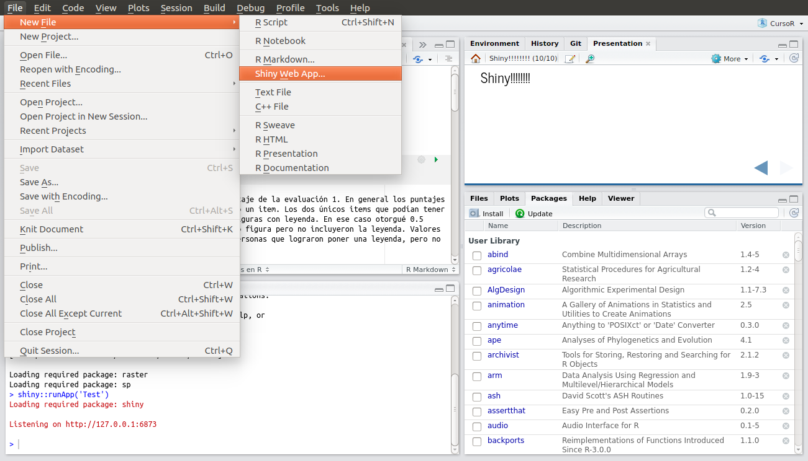
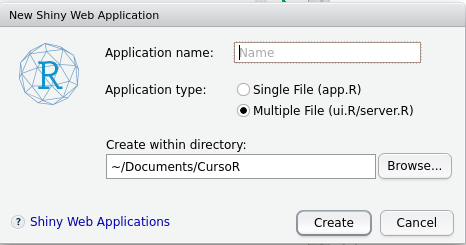
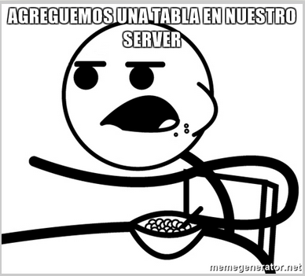
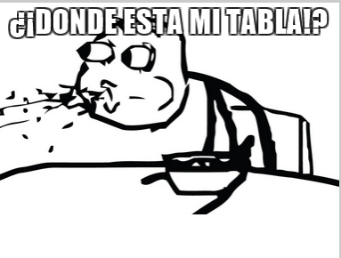
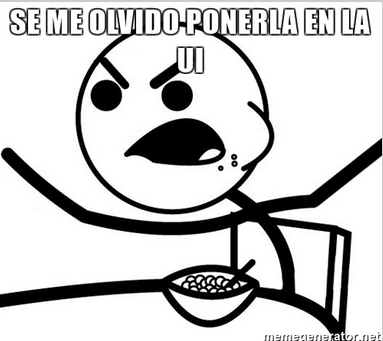

<style>
.reveal h1, .reveal h2, .reveal h3 {
  word-wrap: normal;
  -moz-hyphens: none;
}
</style>

<style>
.small-code pre code {
  font-size: 1em;
}
</style>

Clase 7 Presentaciones En R
========================================================
author: Derek Corcoran
date: "30/08, 2018"
autosize: true
transition: rotate

Tipos de presentaciones en R
========================================================
incremental:true

- **R presentation**
- [Ioslides](http://rmarkdown.rstudio.com/ioslides_presentation_format.html)
- Slidy
- Beamer (PDF)

Como abrir nueva presentación
==========


Se escribe igual que Rmarkdown
==========
incremental:true

* ## es para pasar de una a otra diapo
* {.smaller} texto mas pequeño
* {.build} empezando de a poco

Se escribe igual que Rmarkdown
==========
incremental:true

* === es para pasar de una a otra diapo
* incremental:true justo debajo de los ==== es para que *bullets* pasen progresivamente
* El titulo de la diapo va justo sobre los ====
* si pongo *** entre dos elementos, apareceran en columans distintas
* puedo darle distinto ancho a cada columna poniendo left: 70% justo bajo los === 

personalización CSS 
========

* Código HTML que permite personalizar presentaciones
* Se pone antes del YAML
* Puede ser sencillo como el siguiente


```r
<style>
.reveal h1, .reveal h2, .reveal h3 {
  word-wrap: normal;
  -moz-hyphens: none;
}
</style>
```


Dos CSS que suelo usar 
========
class: small-code
incremental:true


```r
<style>
.reveal h1, .reveal h2, .reveal h3 {
  word-wrap: normal;
  -moz-hyphens: none;
}
</style>
```

* Evita que se separen palabras en los títulos


```r
<style>
.small-code pre code {
  font-size: 1em;
}
</style>
```

* permite poner *class: small-code* bajo un ====
* Más ejemplos [acá](https://rstudio-pubs-static.s3.amazonaws.com/27777_55697c3a476640caa0ad2099fe914ae5.html#/)

Otras cosas
=====

* Texto normal

```r
<small>This sentence will appear smaller.</small>
```
* <small>This sentence will appear smaller.</small>
* Si se meten a la página del curso, cada carpeta de clase tiene un archivo RPres, que es el que creo la presentación


Ecuaciones
===========

```r
$$
  \begin{aligned}
  \dot{x} & = \sigma(y-x) \\
  \end{aligned}
$$  
```

$$
  \begin{aligned}
  \dot{x} & = \sigma(y-x) \\
  \end{aligned}
$$  


* [acá](http://www.statpower.net/Content/310/R%20Stuff/SampleMarkdown.html) pueden ver varios ejemplos de como hacer ecuaciones


======
title: false

# Recreo?
Shiny!!!!!!!!
===



***



* Dos archivos, server y app

server, donde se hacen las cosas
=====

* Generamos gráficos, tablas, calculos, modelos, etc.
* Estos outputs se crean en base a inputs que bienen de ui
* la función principal es renderAlgo (renderTable, renderPlot, renderDataTable, etc.)
* El orden no importa

ui donde se muestran las cosas y 
=====

* Generamos inputs en sliders, cajas de selección, etc.
* Al mover los inputs cambiamos los outputs
* Escribimos tiulos parrafos y seleccionamos estilos
* El orden importa

Generando nuestro primer server
==============


```r
library(shiny)
library(ggplot2)
data("mtcars")

shinyServer(function(input, output) {
   
  output$distPlot <- renderPlot({
    ggplot(mtcars, aes(x = mpg, y = wt)) + geom_point()
  })
  
})
```


==============
class: small-code



***


```r
shinyServer(function(input, output) {
   
  output$distPlot <- renderPlot({
    ggplot(mtcars, aes(x = mpg, y = wt)) + geom_point()
  })
  output$Table <- renderTable({
    mtcars
  })
  
})
```


====


***



Arreglemos el UI
=====
class: small-code


```r
library(shiny)

shinyUI(fluidPage(
  
  titlePanel("Old Faithful Geyser Data"),
  
  sidebarLayout(
    sidebarPanel(
       sliderInput("bins",
                   "Number of bins:",
                   min = 1,
                   max = 50,
                   value = 30)
    ),
    mainPanel(
       plotOutput("distPlot")
    )
  )
))
```

arreglemos la UI
==========
class: small-code


```r
library(shiny)

shinyUI(fluidPage(
  
  titlePanel("Datos de motor trends de 1974"),
  
  sidebarLayout(
    sidebarPanel(
       sliderInput("bins",
                   "Number of bins:",
                   min = 1,
                   max = 50,
                   value = 30)
    ),
    mainPanel(
       plotOutput("distPlot"),
       tableOutput("Table")
    )
  )
))
```


Agreguemos un input a la UI
==========
class: small-code


```r
library(shiny)

shinyUI(fluidPage(
  
  titlePanel("Datos de motor trends de 1974"),
  
  sidebarLayout(
    sidebarPanel(
      selectInput("Variable",
                  "Selecciona la Variable y:",
                  choices = c("cyl", "disp", "hp", "drat", "wt", "qsec", "vs", "am", 
                              "gear", "carb"),
                  selected = "wt")
    ),
    mainPanel(
       plotOutput("distPlot"),
       tableOutput("Table")
    )
  )
))
```

Ha interactuar con el input!!!!!!
==========
class: small-code

* Vamos a server
* Saquemos la tabla por ahora

```r
shinyServer(function(input, output) {
  
  output$distPlot <- renderPlot({
    ggplot(mtcars, aes_string(x = input$Variable, y = "mpg")) + geom_point()
  })
  output$Table <- renderTable({
    mtcars
  })
  
})
```

Generando mas interacción
==========
class: small-code

* UI

```r
    mainPanel(
       plotOutput("distPlot"),
       selectInput("Modelo", "Selecciona el tipo de modelo:",
                   choices = c("lm", "loess", "gam"), selected = "lm")
    )
```

* Server


```r
output$distPlot <- renderPlot({
    ggplot(mtcars, aes_string(x = input$Variable, y = "mpg")) + geom_smooth(method = input$Modelo) + geom_point()
  })
```

Otros tipos de input (slider)
=========
class: small-code
* UI


```r
    sidebarPanel(
      selectInput("Variable",
                  "Selecciona la Variable x:",
                  choices = c("cyl", "disp", "hp", "drat", "wt", "qsec", "vs", "am", 
                              "gear", "carb"),
                  selected = "wt"),
      sliderInput("YLIM", "Selecciona los límites del eje y:", min = 0, max = 40, 
                  step = 2, value = c(0,20)
                  )
    )
```

* Server


```r
  output$distPlot <- renderPlot({
    p <- ggplot(mtcars, aes_string(x = input$Variable, y = "mpg")) + geom_smooth(method = input$Modelo) + geom_point()
    p + ylim(input$YLIM)
  })
```

Otros tipos de input (text)
=========
class: small-code

* UI


```r
        mainPanel(
       plotOutput("distPlot"),
       textInput("Formula", "Escribe la formula de tu modelo:",
                   value =  "y ~ x + I(x^2)")
    )
```

* Server


```r
  output$distPlot <- renderPlot({
    p <- ggplot(mtcars, aes_string(x = input$Variable, y = "mpg")) + stat_smooth(method = "lm", formula = input$Formula) + geom_point()
    p + ylim(input$YLIM)
  })
```

Botón de submit
=========


```r
    mainPanel(
       plotOutput("distPlot"),
       textInput("Formula", "Escribe la formula de tu modelo:",
                   value =  "y ~ x + I(x^2)"),
       submitButton("Actualizar modelo", icon("refresh"))
    )
```

Transformemos algunas variables en factores?
=======================
class: small-code

* ui


```r
sliderInput("YLIM", "Selecciona los límites del eje y:", min = 0, max = 40, 
                  step = 2, value = c(0,20)
                  ),
checkboxGroupInput("Factores", "Transformar en factores:",
                   c("cyl", "disp", "hp", "drat", "wt", "qsec", "vs", "am", 
                      "gear", "carb"), selected = "am")
```


* Server


```r
  output$distPlot <- renderPlot({
    mt <- as.data.frame(map_at(mtcars, factor, .at = input$Factores))
    p <- ggplot(mt, aes_string(x = input$Variable, y = "mpg")) + stat_smooth(method = "lm", formula = input$Formula) + geom_point()
    p + ylim(input$YLIM)
  })
```

Variables en factores (Para que?)
=======================
class: small-code


```r
  output$distPlot <- renderPlot({
    mt <- as.data.frame(map_at(mtcars, factor, .at = input$Factores))
    p<- ggplot(mt, aes_string(x = input$Variable, y = "mpg")) 
    if (class(mt[,input$Variable]) == "numeric"){
      p <- p + stat_smooth(method = "lm", formula = input$Formula) + geom_point()
    }
    if (class(mt[,input$Variable]) == "factor"){
      p <- p + geom_boxplot()
    }
    p + ylim(input$YLIM)
  })
```

Relleno según otra variable
=======================
class: small-code

* UI


```r
checkboxGroupInput("Factores", "Transformar en factores:",
                         c("cyl", "disp", "hp", "drat", "wt", "qsec", "vs", "am", 
                           "gear", "carb"), selected = "am"),
      selectInput("Color",
                  "Color segun la variable:",
                  choices = c("cyl", "disp", "hp", "drat", "wt", "qsec", "vs", "am", 
                              "gear", "carb"))
```

* server

```r
output$distPlot <- renderPlot({
    mt <- as.data.frame(map_at(mtcars, factor, .at = input$Factores))
    p <- ggplot(mt, aes_string(x = input$Variable, y = "mpg"))
    if (class(mt[, input$Variable]) == "numeric") {
        p <- p + stat_smooth(method = "lm", formula = input$Formula, aes_string(fill = input$Color)) + 
            geom_point()
    }
    if (class(mt[, input$Variable]) == "factor") {
        p <- p + geom_boxplot(aes_string(fill = input$Color))
    }
    p + ylim(input$YLIM)
})
```

Evaluación Final
======
incremental:true

Evaluación final (Viernes 14 de Septiembre)

* Informe en PDF
* Debe tener 
    + Introducción
    + Métodos
    + Resultados
    + Conclusiones
    + Bibliografía
